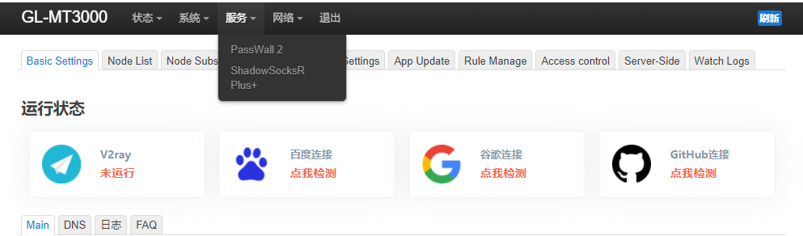
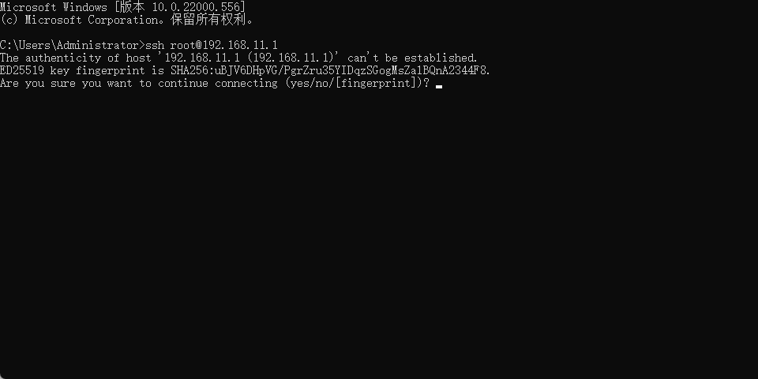
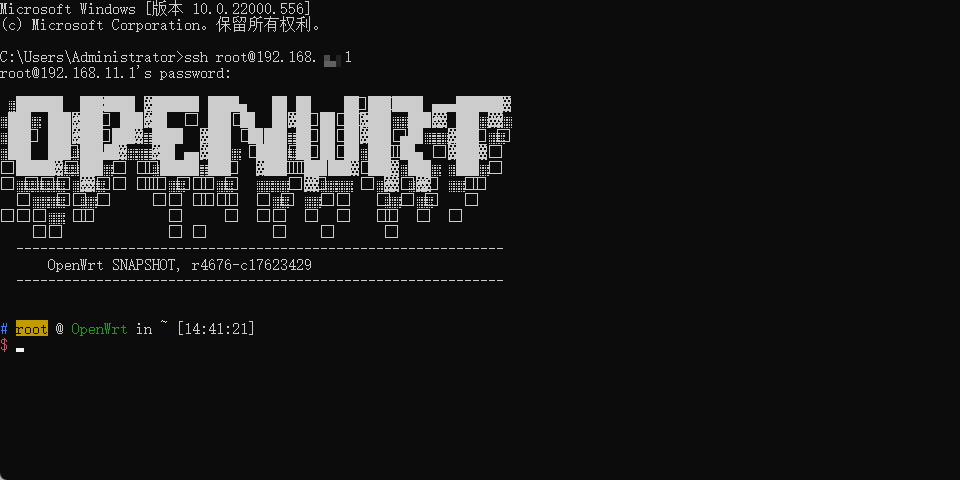
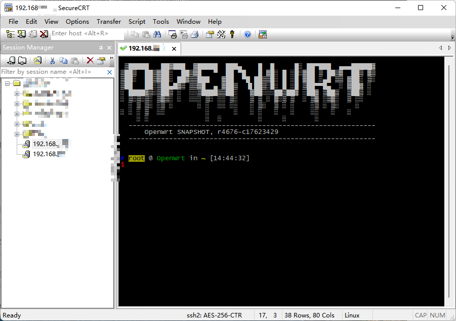
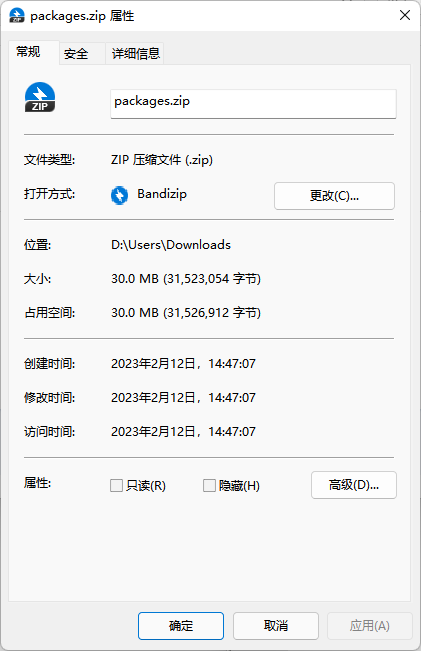
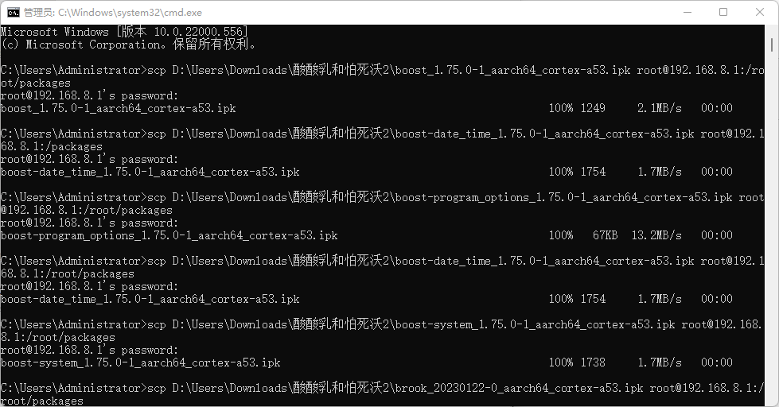

# GL.inet-MT3000-installation-plug-in
# GL.inet-MT3000安装SSR plus、passwall2以及小蓝猫

谨以此记录MT3000的安装步骤，仅供学习参考！！！



## 电脑连上MT3000的网络（有线无线都可），打开CMD窗口ssh测试网关：

```
ssh root@192.168.8.1
```



## 第一次打开输入yes，再输入密码，进入主页面



## 打开shell工具，例如CRT:



在root目录下创建packages文件夹：

```
mkdir packages
cd packages
```

在windows中解压这个包，里面含有必须的ipk文件，会得到35个文件



## 然后重新打开cmd，直接用scp命令远程上传packages文件夹到192.168.8.1的根目录下：



图是单个上传的

建议使用命令，并输入密码：

```
scp -r D:\Users\Downloads\packages
root@192.168.8.1:/root
```

其中D:\Users\Downloads\packages是你的解压地址

上传之后还需要通过指令解压安装（这一步在CRT中进行）：

```
cd packages

opkg update

opkg install ./*
```

最后就大功告成！！！
